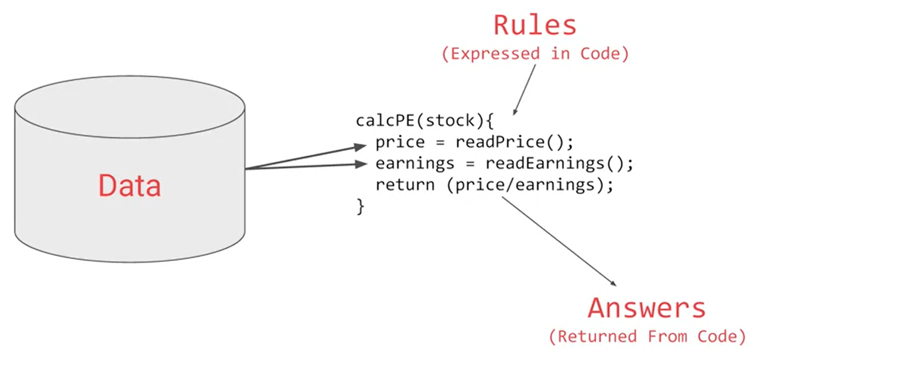
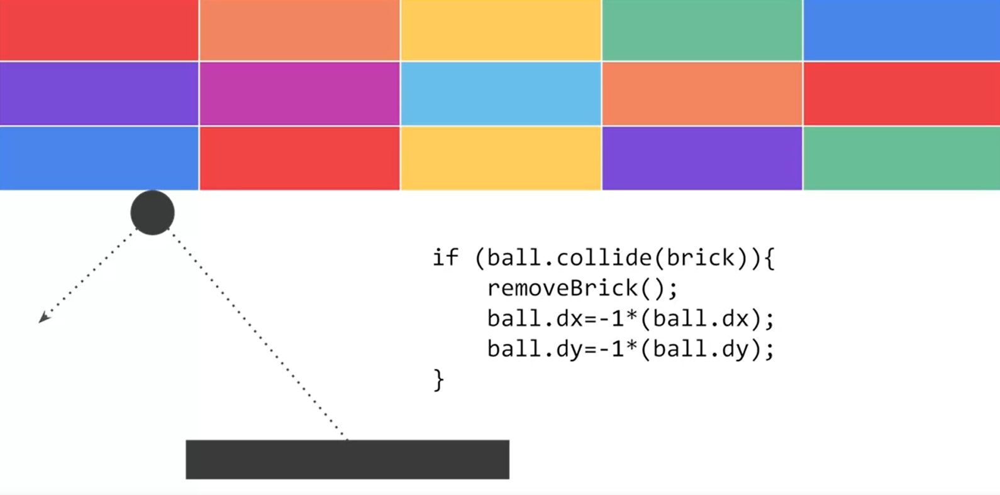
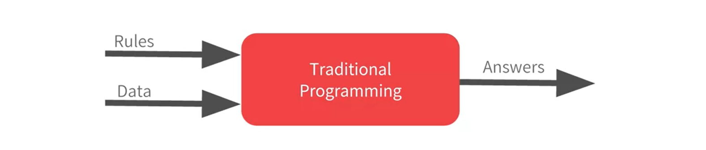
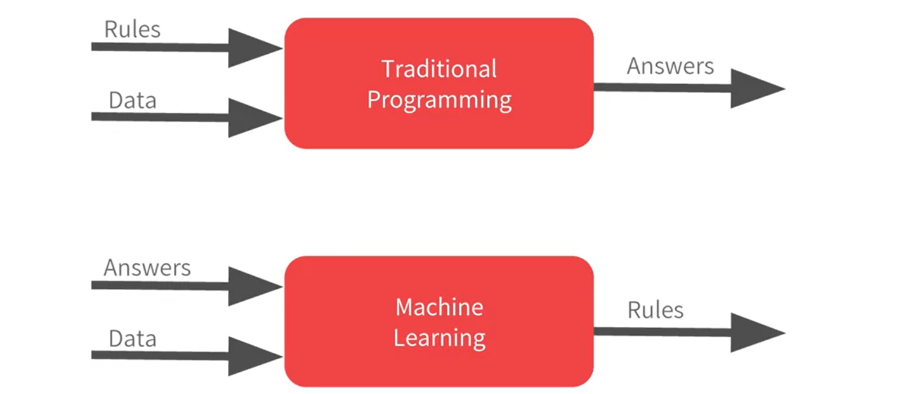
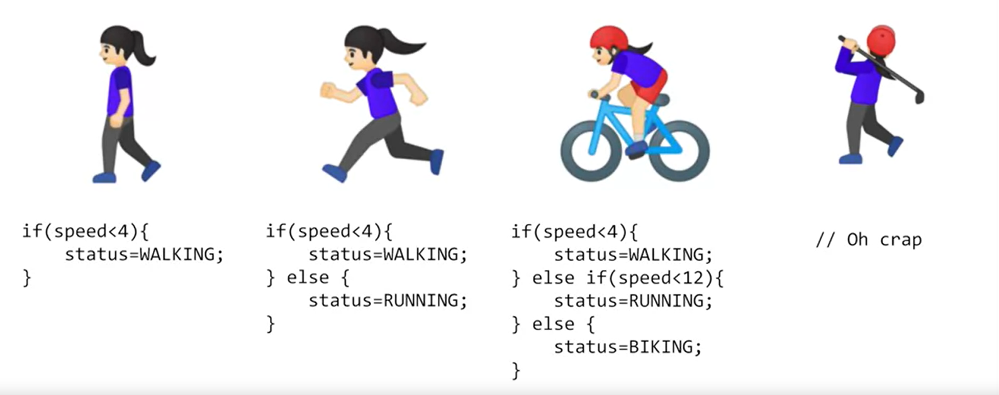
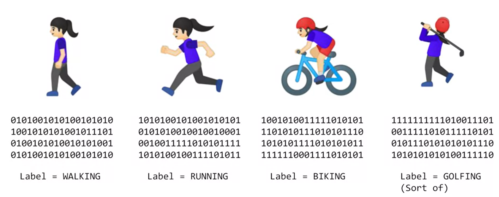
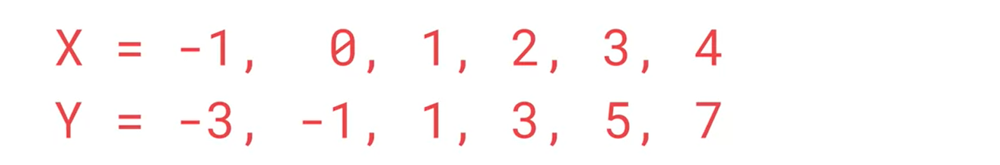
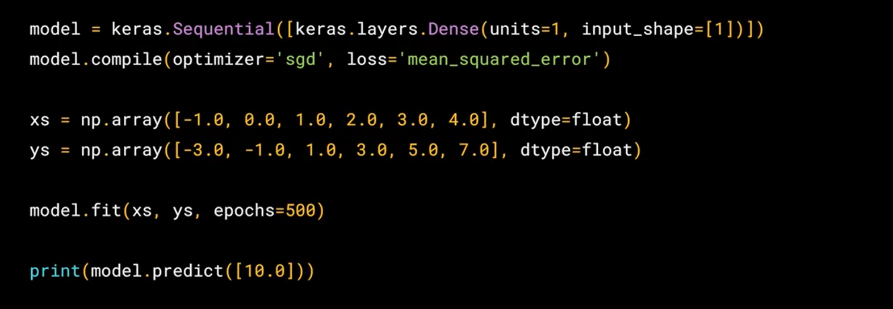
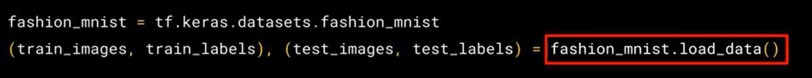

# Introduction to TensorFlow for Artificial Intelligence, Machine Learning, and Deep Learning

TensorFlow for Artificial Intelligence, Machine Learning, and Deep Learning! You’re joining thousands of learners currently enrolled in the course. I'm excited to have you in the class and look forward to your contributions to the learning community.

## Where To Find The Notebooks For This Course

All notebooks in this course can be run in either Google Colab or Coursera Labs. **You don’t need a local environment set up to follow the coding exercises**. You can simply click the **Open in Colab** badge at the top of the ungraded labs while for the assignments, you will be taken automatically to Coursera Labs. 

However, if you want to run them on your local machine, the ungraded labs and assignments for each week can be found in this [Github](https://github.com/https-deeplearning-ai/tensorflow-1-public/tree/main/C1) repository under the **C1** folder. If you already have git installed on your computer, you can clone it with this command:

<pre>
<code>
git clone https://github.com/https-deeplearning-ai/tensorflow-1-public
</code>
</pre>

If not, please follow the guides [here](https://git-scm.com/book/en/v2/Getting-Started-Installing-Git) to install git on your operating system. Once you’ve cloned the repo, you can do a git pull once in a while to make sure that you get the latest updates to the notebooks.

## Package In Use

You will need these packages if you will run the notebooks locally:

<pre>
<code>
    tensorflow==2.7.0
    scikit-learn==1.0.1
    pandas==1.1.5
    matplotlib==3.2.2
    seaborn==0.11.2
</code>
</pre>

## Traductionnal paradigm Programming

* If you are programming app 

* or app for gaming

* We can represent that with this diagram

## Machine Learning Paradiagm Compare To Traductionnal paradigm Programming

## Activity Recognition

## Activity Recognition For Machine Learning

## Machine Learning 

The machine learning is all about a computer learning the patterns that distinguish things.

For example: 

Well, the answer is Y equals 2X minus 1. So whenever you see a Y, it's twice the corresponding X minus 1. If you figured it out for yourself, well done, but how did you do that? How would you think you could figure this out? Maybe you can see that the Y increases by 2 every time the X increases by 1. So it probably looks like Y equals 2X plus or minus something. Then when you saw X equals 0 and Y equals minus 1, so you thought hey that the something is a minus 1, so the answer might be Y equals 2X minus 1. 

## How Can Implement That In Tensorflow

## Intro To Google Colab

[https://www.youtube.com/watch?v=inN8seMm7UI](https://www.youtube.com/watch?v=inN8seMm7UI)

## FAQs about Google Colab (optional)

As mentioned earlier,  you can use Google Colab to follow along with the coding exercises in this course. The previous video showed a quick intro on how to use this environment and here are some [**Frequently Asked Questions**](https://research.google.com/colaboratory/faq.html) in case you want to know more.

## Week 1 Resources

That brings you to the end of what you need to look at for Week 1. If you’re eager to learn more, before we go to Week 2, there are some great resources you can check out:

* AI For Everyone is a non-technical course that will help you understand many of the AI technologies we will discuss later in this course, and help you spot opportunities in applying this technology to solve your problems. [https://www.deeplearning.ai/ai-for-everyone/](https://www.deeplearning.ai/ai-for-everyone/s)
* TensorFlow is available at TensorFlow.org, and video updates from the TensorFlow team are at [youtube.com/tensorflow](https://www.youtube.com/tensorflow)

Play with a neural network right in the browser at [http://playground.tensorflow.org](http://playground.tensorflow.org). See if you can figure out the parameters to get the neural network to pattern match to the desired groups. The spiral is particularly challenging!

## How To Load Dataset In Python

## Responsible AI practices

That link is more useful

* [https://ai.google/responsibilities/responsible-ai-practices/](https://ai.google/responsibilities/responsible-ai-practices/)

## Understant Sequential Layer in Tensorflow

* [https://keras.io/api/models/sequential/](https://keras.io/api/models/sequential/)

## Understant Flatten Layer in Tensorflow

[https://keras.io/api/layers/reshaping_layers/flatten/](https://keras.io/api/layers/reshaping_layers/flatten/)

## Understant Flatten Dense in Tensorflow

[https://keras.io/api/layers/core_layers/dense/](https://keras.io/api/layers/core_layers/dense/)

## Understant  what Activations in in Tensorflow

[https://keras.io/api/layers/activations/](https://keras.io/api/layers/activations/)

### Function ReLu

[https://keras.io/api/layers/activations/#relu-function](https://keras.io/api/layers/activations/#relu-function)

### Function Softmax

* [https://keras.io/api/layers/activations/#softmax-function](https://keras.io/api/layers/activations/#softmax-function)
  
* [https://www.youtube.com/watch?v=LLux1SW--oM](https://www.youtube.com/watch?v=LLux1SW--oM)
